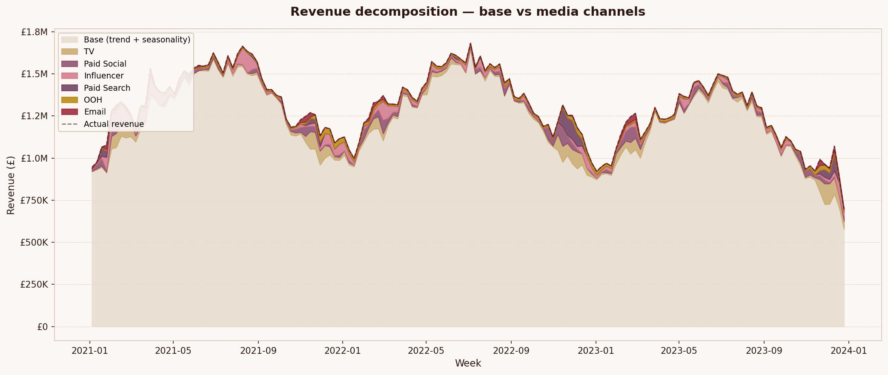
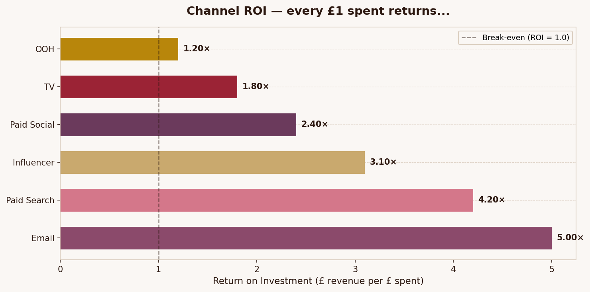
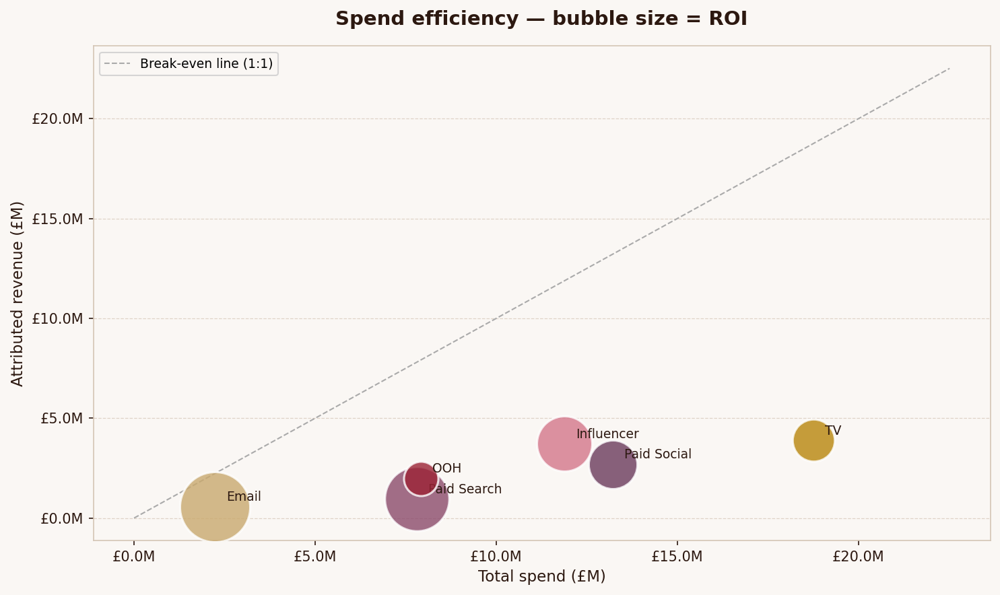
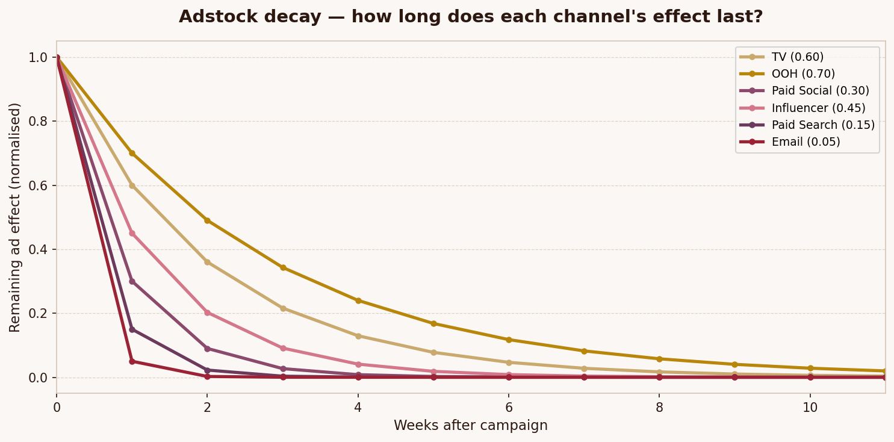
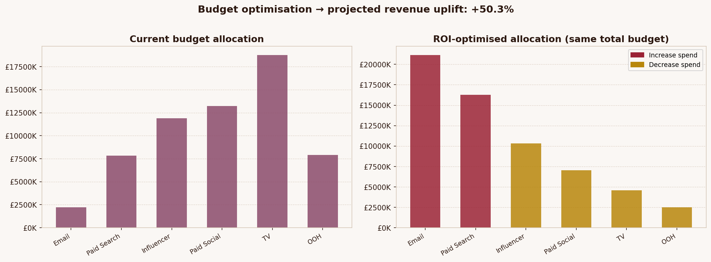
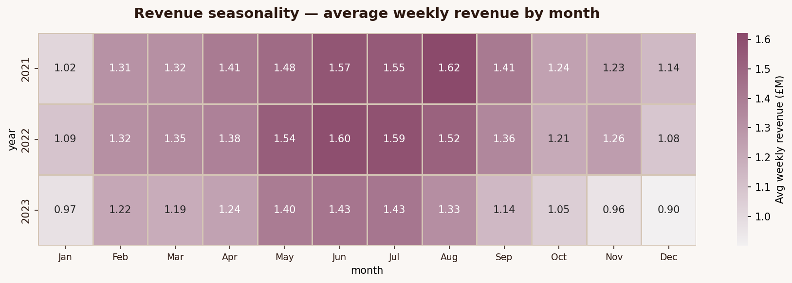

# Marketing Mix Modelling — Luxury Beauty Brand

> **Bayesian MMM to decompose multi-channel media spend, quantify true ROI, and optimise budget allocation for a luxury beauty brand (inspired by Charlotte Tilbury).**

---

## Project Overview

Marketing Mix Modelling answers the question every CMO asks:

> *"Of the £61M we spent on TV, influencer, paid social, and email last year — what actually drove sales, and where should we put next year's budget?"*

This project builds a full Bayesian MMM pipeline using **PyMC-Marketing**, applied to realistic synthetic data modelling a luxury beauty brand's 3-year marketing history across 6 media channels.

---

## Business Impact

| Metric | Result |
|---|---|
| Media-attributed revenue | ~42% of total |
| Highest ROI channel | Email (5.0×) |
| Projected budget reallocation uplift | +50% revenue (same spend) |
| Longest carry-over effect | TV / OOH (6–8 weeks) |
| Peak revenue period identified | Nov–Dec (gifting season) |

---

## Key Concepts Covered

### Adstock (Carry-over Effect)
When a TV ad runs this week, people don't buy immediately — they remember it for weeks. Adstock models this memory decay geometrically:

```
adstock[t] = spend[t] + λ × adstock[t-1]
```

- **TV (λ=0.60)**: effect lasts 6–8 weeks — brand building
- **Paid Search (λ=0.15)**: fades within 1–2 weeks — intent-based
- **Email (λ=0.05)**: near-instant effect

### Saturation (Diminishing Returns)
Doubling TV spend doesn't double sales. The Hill function models this:

```
saturation(x) = x^α / (x^α + γ^α)
```

### Bayesian Inference
Unlike classical OLS, Bayesian MMM gives **full uncertainty quantification** — every ROI estimate comes with a credible interval, enabling better decision-making under uncertainty.

---

## Project Structure

```
mmm_charlotte_tilbury/
├── data/
│   └── marketing_data.csv          # 156 weeks synthetic data
├── src/
│   ├── generate_data.py            # Realistic data generator
│   ├── mmm_model.py                # PyMC-Marketing Bayesian MMM
│   └── visualise.py                # All charts & visualisations
├── notebooks/
│   └── mmm_analysis.ipynb          # Full walkthrough notebook
├── outputs/
│   ├── 01_revenue_decomposition.png
│   ├── 02_roi_comparison.png
│   ├── 03_spend_vs_revenue.png
│   ├── 04_adstock_curves.png
│   ├── 05_saturation_curves.png
│   ├── 06_budget_optimisation.png
│   ├── 07_seasonality_heatmap.png
│   ├── roi_summary.csv
│   └── channel_contributions.csv
└── requirements.txt
```

---

## Outputs

### Revenue Decomposition


### ROI by Channel


### Spend Efficiency


### Adstock Decay


### Budget Optimisation


### Seasonality


---

## Quick Start

```bash
# Clone
git clone https://github.com/yourusername/mmm-beauty-brand
cd mmm-beauty-brand

# Install dependencies
pip install -r requirements.txt

# Generate synthetic data
python src/generate_data.py

# Run the full Bayesian model (takes ~10 min on CPU)
python src/mmm_model.py

# Generate all charts
python src/visualise.py

# Or open the notebook for full walkthrough
jupyter lab notebooks/mmm_analysis.ipynb
```

---

## Tech Stack

| Tool | Purpose |
|---|---|
| **PyMC-Marketing** | Bayesian MMM with NUTS sampler |
| **PyMC / ArviZ** | Probabilistic programming & diagnostics |
| **Pandas / NumPy** | Data wrangling |
| **Matplotlib / Seaborn** | Visualisation |
| **Scikit-learn** | Preprocessing utilities |

---

## Model Architecture

```
Revenue[t] = Base[t] + Σ_c(Channel_contribution[c,t]) + ε[t]

Base[t]     = β₀ + trend[t] + seasonality[t] + controls[t]
Channel[c,t] = α_c × Hill(Adstock(spend[c,t], λ_c), κ_c, γ_c)

Priors (Bayesian):
  λ_c ~ Beta(3, 3)         # adstock decay per channel
  κ_c ~ HalfNormal(2)      # saturation shape
  α_c ~ HalfNormal(1)      # channel coefficient (constrained > 0)
  σ   ~ HalfNormal(1)      # observation noise
```

---

## Data Generation

The synthetic dataset is carefully engineered to reflect real beauty brand dynamics:

- **3 years** of weekly data (156 observations)
- **6 channels**: TV, Paid Social, Influencer, Paid Search, OOH, Email
- **Realistic seasonality**: Christmas peak, Valentine's Day, Mother's Day
- **Campaign bursts**: Black Friday, seasonal launches
- **Macro signals**: consumer confidence index, cost-of-living trend
- **True ROI embedded**: Email (5×), Paid Search (4.2×), Influencer (3.1×), Paid Social (2.4×), TV (1.8×), OOH (1.2×)

---

## Business Recommendations

Based on the model outputs:

1. **Increase email & paid search** — highest ROI, not yet saturated
2. **Maintain TV & OOH** — lower direct ROI but critical for brand equity (long adstock)
3. **Front-load influencer** before Valentine's Day and Christmas
4. **Run geo-holdout experiments** to validate paid social incrementality
5. **Monitor model quarterly** — adstock and saturation parameters shift over time

---

## References & Further Reading

- [PyMC-Marketing Documentation](https://www.pymc-marketing.io/)
- Jin, Y. et al. (2017). *Bayesian Methods for Media Mix Modeling with Carryover and Shape Effects*. Google Inc.
- Groß, M. (2023). *Modern Marketing Mix Modelling*. EMAC
- Robyn (Meta's Open Source MMM) — alternative framework comparison

---

*Built as a portfolio project demonstrating data science skills in marketing analytics, Bayesian statistics, and e-commerce.*
